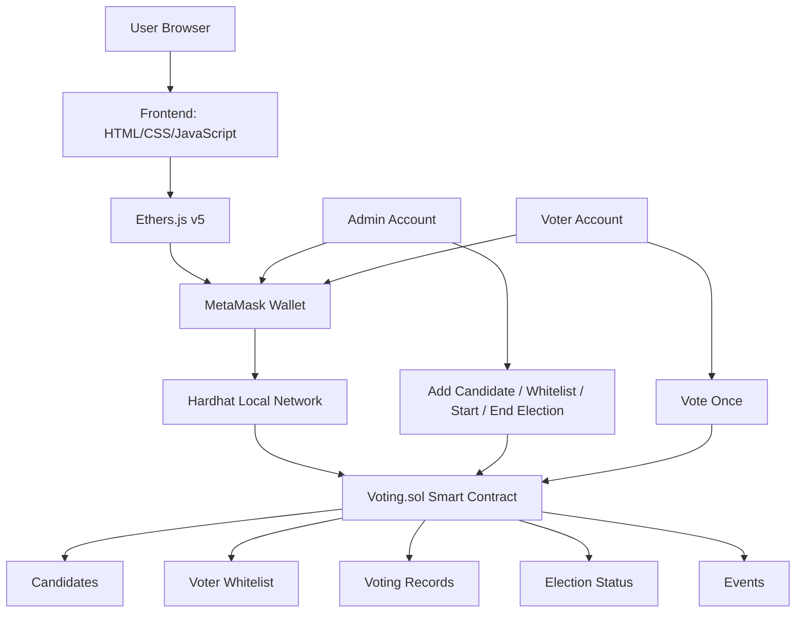
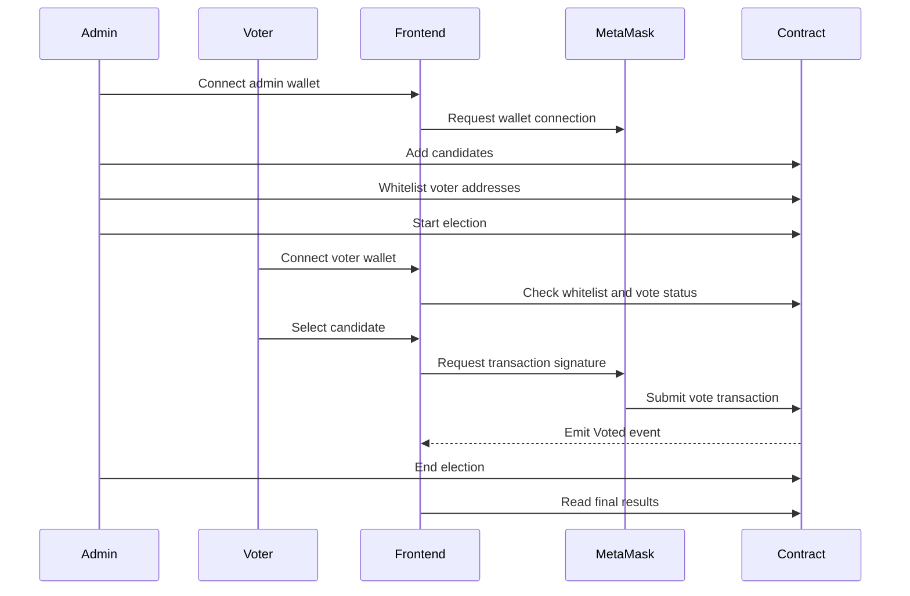

# BlockVote — Blockchain Voting DApp


**BlockVote** is a decentralized voting application built on an Ethereum-compatible blockchain. The system allows an administrator to create candidates, whitelist voters, start or end an election, and let eligible voters cast exactly one vote through a MetaMask-connected web interface.

This project is designed as an educational blockchain DApp that demonstrates how smart contracts can provide transparent, immutable, and verifiable vote counting.

---

## Table of Contents

- [Overview](#overview)
- [Key Features](#key-features)
- [Tech Stack](#tech-stack)
- [System Architecture](#system-architecture)
- [Project Structure](#project-structure)
- [Smart Contract Design](#smart-contract-design)
- [Application Workflow](#application-workflow)
- [Prerequisites](#prerequisites)
- [Installation](#installation)
- [Run the Project Locally](#run-the-project-locally)
- [MetaMask Configuration](#metamask-configuration)
- [Common Commands](#common-commands)
- [Security Notes](#security-notes)
- [Limitations](#limitations)
- [Future Improvements](#future-improvements)
- [GitHub Upload Checklist](#github-upload-checklist)
- [License](#license)

---

## Overview

Traditional online voting systems usually depend on a centralized database controlled by one organization. BlockVote moves the voting rules and vote counting logic into a Solidity smart contract.

The project includes:

- A Solidity smart contract for election management.
- A Hardhat local blockchain environment.
- A deployment script that creates sample candidates and whitelisted voters.
- A browser frontend using HTML, CSS, JavaScript, Bootstrap, Font Awesome, Ethers.js, and MetaMask.
- Admin and voter workflows in one interface.

---

## Key Features

### Admin Features

- Deploy a new voting contract.
- Add candidates before the election starts.
- Whitelist one or multiple voter addresses.
- Start the election when at least two candidates are available.
- End the election.
- View final results and winner information.

### Voter Features

- Connect wallet using MetaMask.
- Check whitelist status.
- View candidates and vote counts.
- Cast exactly one vote while the election is active.
- Confirm voting transaction through MetaMask.
- Track personal voting status.

### Blockchain Features

- One vote per whitelisted address.
- On-chain vote counting.
- Transparent event logs:
  - `CandidateAdded`
  - `VoterWhitelisted`
  - `ElectionStarted`
  - `ElectionEnded`
  - `Voted`
- Immutable transaction history.
- Public read-only functions for election data.

---

## Tech Stack

| Layer | Technology | Purpose |
|---|---|---|
| Smart Contract | Solidity `^0.8.19` | Defines election rules and voting logic |
| Blockchain Development | Hardhat | Compile, deploy, and run local blockchain |
| Contract Interaction | Ethers.js v5 | Connect frontend to smart contract |
| Wallet | MetaMask | User authentication and transaction signing |
| Frontend | HTML, CSS, JavaScript | Web user interface |
| UI Framework | Bootstrap 5 | Responsive layout and components |
| Icons | Font Awesome 6 | Interface icons |
| Runtime | Node.js / npm | Package and script management |

---

## System Architecture



---

## Project Structure

```text
Code_Project_Blockchain/
├── contracts/
│   └── Voting.sol                 # Main voting smart contract
├── scripts/
│   └── deploy.js                  # Deploy contract and seed demo data
├── frontend/
│   ├── index.html                 # Main web interface
│   ├── css/
│   │   └── style.css              # Custom UI styling
│   └── js/
│       └── app.js                 # Ethers.js + MetaMask frontend logic
├── artifacts/                     # Hardhat generated build artifacts
├── hardhat.config.js              # Hardhat configuration
├── package.json                   # Project metadata and npm scripts
└── README.md
```

> `artifacts/` is generated by Hardhat after compiling. It can be committed for demo purposes, but most production repositories regenerate it locally.

---

## Smart Contract Design

The main smart contract is:

```text
contracts/Voting.sol
```

### Core State Variables

| Variable | Type | Description |
|---|---|---|
| `owner` | `address` | Admin address, set to the deployer |
| `electionTitle` | `string` | Title of the election |
| `candidates` | `Candidate[]` | Private array storing candidate data |
| `whitelist` | `mapping(address => bool)` | Tracks whether an address is allowed to vote |
| `hasVoted` | `mapping(address => bool)` | Prevents double voting |
| `voterChoice` | `mapping(address => uint256)` | Stores the candidate selected by each voter |
| `electionActive` | `bool` | Indicates whether voting is currently open |
| `electionEnded` | `bool` | Indicates whether the election has ended |
| `totalVotes` | `uint256` | Total number of votes cast |
| `startTime` | `uint256` | Election start timestamp |
| `endTime` | `uint256` | Election end timestamp |

### Candidate Structure

```solidity
struct Candidate {
    string name;
    string description;
    uint256 voteCount;
}
```

### Main Functions

| Function | Access | Purpose |
|---|---|---|
| `addCandidate(name, description)` | Admin only | Add a candidate before the election starts |
| `whitelistVoter(voter)` | Admin only | Grant voting permission to one address |
| `whitelistMultipleVoters(voters)` | Admin only | Grant voting permission to multiple addresses |
| `startElection()` | Admin only | Start the election |
| `endElection()` | Admin only | End the election |
| `vote(candidateId)` | Whitelisted voter | Cast one vote for a candidate |
| `getAllCandidates()` | Public view | Read all candidate data |
| `getElectionStatus()` | Public view | Read active/ended status and timestamps |
| `getWinner()` | Public view | Get winner after the election ends |

---

## Application Workflow



---

## Prerequisites

Install the following tools before running the project:

- Node.js 18 or later
- npm
- MetaMask browser extension
- A modern browser such as Chrome, Edge, Brave, or Firefox

Check your installed versions:

```bash
node -v
npm -v
```

---

## Installation

Clone the repository:

```bash
git clone https://github.com/<your-username>/<your-repository-name>.git
cd <your-repository-name>
```

Install dependencies:

```bash
npm install
```

Compile the smart contract:

```bash
npm run compile
```

---

## Run the Project Locally

This project is intended to run on a local Hardhat blockchain.

### Step 1: Start Hardhat Local Node

Open terminal 1:

```bash
npm run node
```

Hardhat will start a local blockchain at:

```text
http://127.0.0.1:8545
```

It will also print multiple test accounts and private keys. These accounts are for local development only.

---

### Step 2: Deploy the Smart Contract

Open terminal 2:

```bash
npm run deploy
```

The deploy script will:

1. Deploy `Voting.sol`.
2. Create four sample candidates.
3. Whitelist up to nine test voter accounts.
4. Print the deployed contract address.

Example output:

```text
Contract Address: 0x5FbDB2315678afecb367f032d93F642f64180aa3
```

---

### Step 3: Update Contract Address in Frontend

Open:

```text
frontend/js/app.js
```

Find this line:

```javascript
const CONTRACT_ADDRESS = "0x5FbDB2315678afecb367f032d93F642f64180aa3";
```

Replace it with the contract address printed by the deploy script.

---

### Step 4: Open the Frontend

You can open the frontend directly:

```text
frontend/index.html
```

Recommended option: use VS Code Live Server or any static server.

Example using `npx serve`:

```bash
npx serve frontend
```

Then open the local URL shown in your terminal.

---

## MetaMask Configuration

Add the Hardhat local network manually in MetaMask.

| Field | Value |
|---|---|
| Network Name | Hardhat Localhost |
| RPC URL | `http://127.0.0.1:8545` |
| Chain ID | `31337` |
| Currency Symbol | `ETH` |

### Import Local Test Accounts

When running:

```bash
npm run node
```

Hardhat prints test account private keys.

Import them into MetaMask:

```text
MetaMask → Account icon → Import account → Paste private key
```

Recommended local demo account mapping:

| Account | Role |
|---|---|
| Account #0 | Admin / contract deployer |
| Account #1 to #9 | Whitelisted voters |

> Never use Hardhat private keys on a real network. They are public development keys and must only be used for local testing.

---

## Common Commands

| Command | Description |
|---|---|
| `npm install` | Install dependencies |
| `npm run compile` | Compile Solidity contract |
| `npm run node` | Start local Hardhat blockchain |
| `npm run deploy` | Deploy contract to local Hardhat network |
| `npm run test` | Run Hardhat tests if test files are available |
| `npm run clean` | Remove Hardhat cache and artifacts |

---

## Frontend Features

The frontend is implemented in:

```text
frontend/index.html
frontend/css/style.css
frontend/js/app.js
```

Main frontend functions include:

| Function | Description |
|---|---|
| `connectWallet()` | Connect MetaMask wallet |
| `disconnectWallet()` | Disconnect current frontend session |
| `ensureCorrectNetwork()` | Ensure user is on Hardhat local chain |
| `loadElectionInfo()` | Load election title and status |
| `loadCandidates()` | Load all candidates from smart contract |
| `loadUserStatus()` | Check whitelist and vote status |
| `addCandidate()` | Admin adds a candidate |
| `whitelistVoter()` | Admin whitelists a voter |
| `startElection()` | Admin starts the election |
| `endElection()` | Admin ends the election |
| `executeVote()` | Voter submits a vote transaction |
| `renderResults()` | Display current or final results |

---

## Security Notes

This project is suitable for learning and demonstration, but it is not production-ready.

Important security observations:

- The system uses an `owner`-based admin model.
- Only the deployer can add candidates, whitelist voters, and control election state.
- Each address can vote only once.
- Only whitelisted addresses can vote.
- Vote counts are stored on-chain and cannot be edited directly.
- Voting is not private because blockchain data is publicly readable.
- `voterChoice` stores each voter’s selected candidate ID, so this is not a secret ballot implementation.
- There is no decentralized identity verification.
- There is no commit-reveal scheme or zero-knowledge privacy layer.
- Local Hardhat private keys must never be used on mainnet or public testnets.

---

## Limitations

- Works mainly as a local demo DApp.
- No backend server or database is included.
- No automated test files are included in the current project.
- No production deployment script for public testnets is included.
- Election data is simple and not optimized for large-scale voting.
- Admin still has centralized control over candidate creation and voter whitelisting.
- Current frontend uses a hardcoded contract address that must be updated after deployment.

---

## Future Improvements

Potential upgrades:

- Add complete Hardhat unit tests.
- Add deployment support for Sepolia or another Ethereum testnet.
- Move contract address and ABI loading into a generated config file.
- Add a proper `.env` configuration system.
- Add role-based access control with OpenZeppelin.
- Add commit-reveal voting to improve ballot privacy.
- Add zero-knowledge proof integration for anonymous voting.
- Add event indexing with The Graph or a backend indexer.
- Add election creation factory contract for multiple elections.
- Add Docker support for easier setup.
- Add CI workflow for compile/test on GitHub Actions.

---

## GitHub Upload Checklist

Before uploading to GitHub, check the following:

### Recommended `.gitignore`

Create a `.gitignore` file if it does not already exist:

```gitignore
node_modules/
cache/
coverage/
.env
.env.local
.DS_Store
npm-debug.log*
yarn-debug.log*
yarn-error.log*
```

Optional Hardhat generated output:

```gitignore
artifacts/build-info/
```

You may keep `artifacts/contracts/Voting.sol/Voting.json` if your frontend or documentation needs the ABI, but in most Hardhat projects the `artifacts/` folder is regenerated using:

```bash
npm run compile
```

### Repository Quality Checklist

- [ ] Remove `node_modules/` before pushing.
- [ ] Do not commit real private keys or seed phrases.
- [ ] Do not use real wallet accounts in demos.
- [ ] Make sure `frontend/js/app.js` uses the correct contract address for your demo.
- [ ] Add screenshots or a short demo GIF if available.
- [ ] Verify that `npm install`, `npm run compile`, `npm run node`, and `npm run deploy` work from a fresh clone.
- [ ] Update repository link and author information if needed.

---

## Learning Outcomes

Through this project, learners can understand:

- How a Solidity smart contract stores and validates voting logic.
- How Hardhat is used for local blockchain development.
- How MetaMask signs transactions from a web frontend.
- How Ethers.js connects a browser app to a smart contract.
- How blockchain events improve transparency and auditability.
- Why blockchain voting still requires careful design for privacy, identity, and governance.

---

## License

This project is released under the **MIT License**.

---

## Author
- Truong Xuan Nhat
- Ngo Tuan Phat
- Le Van Anh Thong

**BlockVote Project**  
Developed as an educational blockchain-based voting system.
